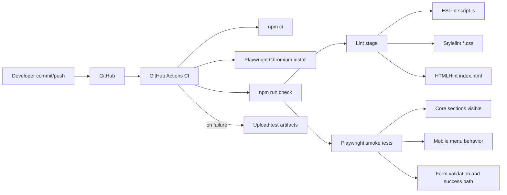

# System Architecture

This document visualizes the FixIt Pro landing page architecture and the delivery pipeline.

## Runtime Architecture

```mermaid
flowchart TD
    U[User Browser] --> H[index.html]
    H --> C[styles.css]
    C --> B[base.css]
    C --> L[layout.css]
    C --> S[sections.css]
    C --> P[components.css]
    C --> R[responsive.css]
    H --> J[script.js]

    J --> N1[Navbar + scroll state]
    J --> N2[Mobile menu]
    J --> N3[Smooth scroll + back-to-top]
    J --> N4[Reveal animations]
    J --> N5[FAQ accordion]
    J --> N6[Contact form validation + submit]
    J --> N7[Dynamic footer year]

    N6 --> F1[Form metadata in HTML]
    F1 --> F2[data-netlify + form-name + honeypot]
    N6 --> F3[POST form payload]
    F3 --> E1[Endpoint from form action]

    E1 -->|Production| NP[Netlify Forms ingestion]
    E1 -->|Local test/dev| LS[tests/static-server.cjs]
    LS --> OK[{ok: true}]
    NP --> LEAD[Lead captured]
```

## Delivery and Quality Pipeline



## Notes

- The runtime is intentionally static and single-page.
- JavaScript behavior is organized as initializer functions called on `DOMContentLoaded`.
- Form handling is provider-compatible in production and mockable in local tests.
